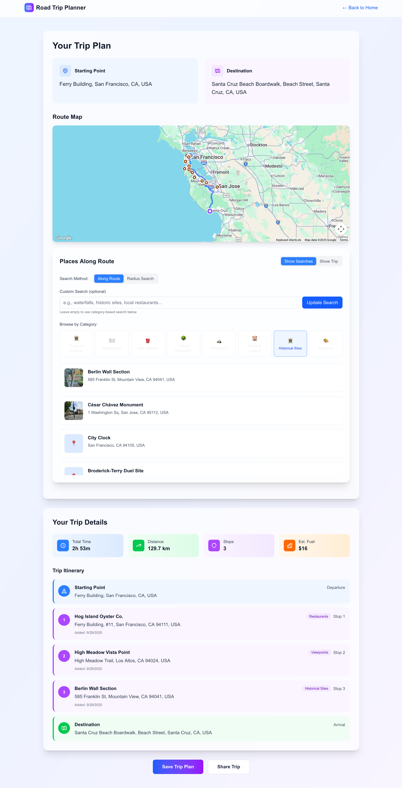

# 🗺️ Road Trip Planner

A beautiful, modern web application for planning epic road trips with intelligent route optimization, interactive maps, and smart place discovery.


## ✨ Features

### 🎯 Smart Trip Planning
- **Intelligent Autocomplete**: Powered by Google Places API for accurate location search
- **Real-time Route Calculation**: Dynamic route optimization using Google Maps
- **Interactive Map Interface**: Full-featured Google Maps integration with custom markers
- **Save & Share Trips**: Persistent trip storage with shareable URLs

### 📍 Place Discovery
- **Points of Interest**: Discover restaurants, gas stations, tourist attractions along your route
- **Smart Filtering**: Filter places by category (restaurants, attractions, gas stations, etc.)
- **Route Integration**: Add discovered places directly to your trip itinerary
- **Rich Place Details**: View ratings, photos, and essential information for each location

### 💾 Trip Management
- **Save Trips**: Store your planned trips locally for future reference
- **Load Saved Trips**: Quickly access and modify previously planned routes
- **Trip Sharing**: Generate shareable URLs to share your itinerary with others
- **Trip History**: View and manage all your saved road trips

## 🚀 Screenshot



Manage all your saved trips with the ability to load, edit, or share them with friends and family.

## 🛠️ Tech Stack

- **Frontend**: Next.js 15.3.4 with React 19
- **Styling**: Tailwind CSS 4 with custom gradients and animations
- **Maps**: Google Maps JavaScript API with React wrapper
- **Places**: Google Places API for location search and discovery
- **Storage**: Local storage for trip persistence
- **TypeScript**: Full type safety throughout the application

## 🚀 Getting Started

### Prerequisites

- Node.js 18+ and npm
- Google Maps API key with the following APIs enabled:
  - Maps JavaScript API
  - Places API
  - Geocoding API
  - Routes API

### Installation

1. **Clone the repository**
   ```bash
   git clone <repository-url>
   cd road_trip_planner
   ```

2. **Install dependencies**
   ```bash
   npm install
   ```

3. **Set up environment variables**
   Create a `.env.local` file in the root directory:
   ```env
   NEXT_PUBLIC_GOOGLE_MAPS_API_KEY=your_google_maps_api_key_here
   ```

4. **Start the development server**
   ```bash
   npm run dev
   ```

5. **Open your browser**
   Navigate to [http://localhost:3000](http://localhost:3000) to see the application

## 🔧 Available Scripts

```bash
npm run dev      # Start development server
npm run build    # Build for production
npm run start    # Start production server
npm run lint     # Run ESLint
```

## 📱 Usage

### Planning a Trip

1. **Enter Start and Destination**: Use the smart autocomplete to select your starting location and destination
2. **View Route**: See your route displayed on the interactive map
3. **Discover Places**: Explore restaurants, gas stations, and attractions along your route
4. **Add Stops**: Click on places to add them to your trip itinerary
5. **Save Trip**: Save your planned trip with a custom name and description
6. **Share**: Generate a shareable URL to send to friends and family

### Managing Saved Trips

- **View Saved Trips**: Access all your saved trips from the home page
- **Load Trip**: Click "Load Trip" to open a previously saved itinerary
- **Update Trip**: Modify loaded trips and save changes
- **Delete Trip**: Remove trips you no longer need
- **Share Trip**: Generate URLs to share specific trips

## 🏗️ Architecture

### Project Structure
```
src/
├── app/
│   ├── page.tsx              # Home page with trip planning form
│   ├── planner/page.tsx      # Main route planning interface
│   ├── shared/trip/page.tsx  # Shared trip viewing page
│   └── layout.tsx            # App layout and metadata
├── components/
│   ├── GoogleMap.tsx         # Interactive map component
│   ├── RoutePlacesSearch.tsx # Places discovery interface
│   ├── RouteGenerator.tsx    # Route calculation logic
│   └── PointsOfInterest.tsx  # POI display component
└── utils/
    └── tripSession.ts        # Trip data management utilities
```

### Key Components

- **GoogleMap**: Interactive map with route display and place markers
- **RoutePlacesSearch**: Smart search interface for discovering places along routes
- **RouteGenerator**: Handles route calculation and optimization
- **TripSession Utils**: Manages trip data persistence and sharing

## 🌟 Key Features Deep Dive

### Intelligent Route Planning
The app uses Google's Routes API to calculate optimal paths between locations, considering traffic patterns and road conditions.

### Smart Place Discovery
Places along your route are automatically discovered and categorized. The app intelligently filters results based on your route to show only relevant locations.

### Offline-First Design
Trip data is stored locally using browser storage, ensuring your trips are always accessible even without an internet connection.

### Responsive Design
Fully responsive interface that works beautifully on desktop, tablet, and mobile devices.

## 🔒 Privacy & Data

- Trip data is stored locally in your browser
- No personal information is sent to external servers
- Google Maps APIs are used only for mapping and place information
- Shared trip URLs contain only trip metadata, not personal data
